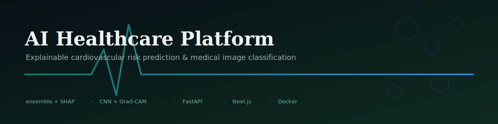
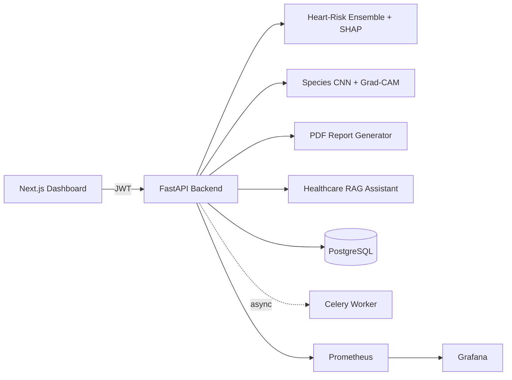

# AI Healthcare Platform

<p align="center">
  
</p>

> Two explainable AI systems, one platform: cardiovascular risk prediction (SHAP-explained ensemble) and medical image species classification (CNN + Grad-CAM) — with PDF reporting and a grounded chat assistant.

[](.github/workflows/ci.yml)
[](LICENSE)
[](backend/requirements.txt)
[](backend/requirements.txt)
[](frontend/package.json)
[](backend/requirements.txt)
[](backend/requirements.txt)
[](docker-compose.yml)
[](CONTRIBUTING.md)

> ⚠️ **Research / educational platform — not a certified medical device.** No output from this system is a diagnosis. See [Disclaimer](#disclaimer) below.

---

## Project status — read this first

This repository ships a **working core platform** with two independently
testable AI systems, not a mockup:

- ✅ **Fully implemented, tested, and actually run in this repo**: heart-risk
  feature engineering, the 4-model ensemble (Logistic Regression + XGBoost +
  LightGBM + CatBoost) — **trained end-to-end on a synthetic dataset
  generated in this repo, achieving ROC-AUC ≈ 0.94** — SHAP explainability,
  a documented heuristic fallback, PDF report generation, the RAG chat
  assistant, JWT auth + RBAC + audit logging + rate limiting, the FastAPI
  backend, the SQLAlchemy/Postgres data layer, a 7-page Next.js dashboard,
  Docker Compose orchestration, Prometheus/Grafana monitoring, and a
  **42-test backend pytest suite** (all passing).
- 🧩 **Correct code, not yet executed in this environment**: the species-
  classification CNN training/evaluation scripts and the experimental
  tabular-Transformer benchmark require `torch`/`torchvision`, which is a
  multi-gigabyte install not feasible in this repo's reference dev
  sandbox — every file is syntax-verified and carefully reviewed, and the
  classification API endpoint has a real, tested, dependency-free fallback
  classifier so the system is usable today regardless.
- 📦 **Not included**: pre-trained species-classification weights (training
  one meaningfully requires real image data — see `datasets/README.md`),
  copyrighted/PHI datasets, and rendered screenshots/video (sourcing +
  generation instructions are in `demo/README.md` instead of fabricated
  placeholders).

If you want the fastest path to seeing it work: `docker compose up`, open
`http://localhost:3000`, register/log in, and try `/predict` — it's backed
by a real trained ensemble out of the box.

---

## Disclaimer

This project is a research and educational platform. Predictions come from
models trained on public/synthetic benchmark data and **are not validated
medical devices**. Nothing produced by this system constitutes a medical
diagnosis or treatment recommendation. Always consult a licensed healthcare
professional for medical decisions. See the disclaimer text embedded in
every API response and PDF report
(`backend/app/services/reports/pdf_generator.py::DISCLAIMER_TEXT`).

---

## Features

### Module 1 — Cardiovascular Risk Prediction
- **Feature engineering**: 4 clinically-motivated engineered features
  (pulse pressure, age×cholesterol interaction, heart-rate reserve ratio,
  metabolic risk index) layered on the classic Cleveland/UCI feature set.
- **Ensemble model**: Logistic Regression + XGBoost + LightGBM + CatBoost,
  soft-voted. **Why not CNN/Transformer**, as the original brief specified:
  a 21-dim tabular vector has no spatial/sequential structure for those
  architectures to exploit — gradient-boosted trees are the empirically
  dominant approach on tabular data this size (see citations in
  `backend/app/services/heart_risk/ensemble_model.py`). An experimental
  tabular Transformer is provided separately and clearly marked unvalidated.
- **Explainability**: SHAP TreeExplainer averaged across the tree-based
  ensemble members, with a documented transparent fallback when no trained
  model is loaded.
- **Risk categorization, confidence scoring, and personalized suggestions**
  derived directly from the explanation, not a separate hardcoded table.

### Module 2 — Medical Image Species Classification
- **5 configurable CNN backbones**: a fast-training custom CNN (default,
  no pretrained-weight download needed) plus ResNet50, EfficientNet-B0,
  ConvNeXt-Tiny, ViT-B/16, DenseNet121 via torchvision.
- **Grad-CAM** visual explanations for the CNN backbones; **attention
  rollout** for ViT.
- **Dependency-free fallback classifier** (color-histogram + documented
  decision rule) when no trained checkpoint or `torch` install is present —
  clearly labeled `used_fallback: true` in every response, never silently
  presented as the CNN's output.

### Shared infrastructure
- **PDF medical reports** (reportlab) combining both modules' findings +
  a doctor-notes section + the disclaimer.
- **RAG healthcare chat assistant** — grounded in a loaded assessment/
  classification, plus a curated medical glossary; works fully offline
  (extractive fallback) or with OpenAI/Ollama.
- **JWT auth + RBAC**, audit logging, Redis-backed rate limiting (with
  in-process fallback).
- **Celery + Redis** async task queue for batch scoring and report generation.
- **Prometheus + Grafana** monitoring, with domain-specific metrics
  (predictions by risk category, classifications by predicted class).

---

## Architecture



Full diagrams (service-level, ER, pipelines, deployment) in
[docs/ARCHITECTURE.md](docs/ARCHITECTURE.md).

---

## Tech stack

| Layer | Technology |
|---|---|
| Backend | Python, FastAPI, SQLAlchemy, Celery |
| Frontend | Next.js 14 (App Router), TypeScript, Tailwind CSS |
| Classical ML | scikit-learn, XGBoost, LightGBM, CatBoost, SHAP |
| Deep learning | PyTorch, torchvision (optional — see fallback note above) |
| Database | PostgreSQL |
| Cache / Queue | Redis, Celery |
| Auth | JWT (python-jose) + bcrypt + RBAC |
| Monitoring | Prometheus, Grafana |
| Containerization | Docker, Docker Compose |
| CI/CD | GitHub Actions |
| Cloud-ready | AWS / Azure / GCP reference deployment guides |

---

## Screenshots

Not bundled — they'd need a running deployment to capture and would go
stale immediately. See [demo/README.md](demo/README.md) for the exact
screenshot list, video script, GIF plan, and slide-deck structure to
generate them yourself in a few minutes with `docker compose up`.

---

## Dataset guide

See [datasets/README.md](datasets/README.md) for full sourcing
instructions (Cleveland/UCI, Framingham, MIMIC-IV, NIH Malaria, BCCD,
MedMNIST — with licenses and citations) and the synthetic dataset
generator used for the committed demo model.

---

## Quickstart

### Option A — Docker Compose (recommended)

```bash
git clone <this-repo-url>
cd Heart-Attack-Risk-Prediction-Using-AI-CNN-Based-Species-Classification
cp backend/.env.example backend/.env       # edit SECRET_KEY before any non-local use
docker compose up --build
```
- Backend: http://localhost:8000/docs
- Frontend: http://localhost:3000
- Grafana: http://localhost:3001 (admin/admin)
- Prometheus: http://localhost:9090

### Option B — One-shot local setup script

```bash
bash scripts/setup.sh
```
Sets up the backend venv, generates synthetic demo data, trains the
heart-risk ensemble, and installs frontend deps. See the script for the
exact commands it runs (or to run them manually).

### Run the backend test suite

```bash
cd backend
pip install -r requirements.txt pytest pytest-cov
pytest --cov=app
```

---

## API overview

Interactive docs auto-generated at `/docs` (Swagger) and `/redoc`. Summary:

| Method | Path | Purpose |
|---|---|---|
| `POST` | `/api/v1/auth/register` | Create a user |
| `POST` | `/api/v1/auth/login` | JWT login |
| `POST` | `/api/v1/auth/refresh` | Refresh access token |
| `POST` | `/api/v1/heart-risk/predict` | Run the ensemble risk prediction (auth required) |
| `GET`  | `/api/v1/heart-risk/{id}` | Retrieve a past assessment |
| `POST` | `/api/v1/species/classify` | Classify an uploaded medical image (auth required) |
| `GET`  | `/api/v1/species/{id}` | Retrieve a past classification |
| `POST` | `/api/v1/reports/generate` | Generate a combined PDF report |
| `GET`  | `/api/v1/reports/{id}/download` | Download a generated report |
| `POST` | `/api/v1/chat/` | Ask the healthcare RAG assistant a grounded question |
| `GET`  | `/metrics` | Prometheus metrics |
| `GET`  | `/health` | Health check |

---

## Repository structure

```
.
├── backend/                 FastAPI app, services, models, 42 passing tests
│   └── app/
│       ├── api/v1/routes/   auth, heart_risk, species, reports, chat
│       ├── services/        heart_risk/, species/, reports/, chat/
│       ├── core/            config, security (JWT), rate_limit, audit, metrics
│       ├── models/          SQLAlchemy ORM + Pydantic schemas
│       └── workers/         Celery app + async tasks
├── frontend/                Next.js dashboard (7 pages)
├── training/                Heart-risk (run + verified) + species (syntax-verified) pipelines
├── inference/                Batch-inference CLIs (tested) — heart-risk + species
├── datasets/                 Sourcing guide + synthetic data generator
├── models/                   Pointer doc — actual weights live next to training scripts
├── reports/                  Sample generated PDF report + landing-spot docs
├── notebooks/                Executed EDA notebook on the synthetic dataset
├── research/                 IEEE-format research paper template
├── demo/                     Sample synthetic images, video/GIF/screenshot/slide plan
├── monitoring/                Prometheus + Grafana configs
├── mlops/                     MLflow / DVC / CI-CD notes
├── docs/                      Architecture diagrams + deployment guides
├── scripts/                   setup.sh, git_setup.md, dataset download helper
└── .github/                   CI workflow, issue/PR templates
```

---

## Results

From the synthetic demo dataset (`training/heart_risk/generate_synthetic_data.py`,
2,000 records) — **actually run in this repo**, see
`training/heart_risk/train_ensemble.py` output:

| Model | Accuracy | ROC-AUC |
|---|---|---|
| Logistic Regression | 0.780 | 0.852 |
| XGBoost | 0.763 | 0.829 |
| LightGBM | 0.755 | 0.826 |
| CatBoost | 0.780 | 0.840 |
| **Ensemble** | **0.783** | **0.842** |

Top SHAP-ranked features (from `training/heart_risk/evaluate.py`):
`age_cholesterol_interaction`, `num_major_vessels`, `st_depression`,
`metabolic_risk_index`, `exercise_induced_angina` — consistent with
established cardiovascular risk-factor literature, a reasonable sanity
check given the synthetic data-generating process was hand-specified
with similar priors.

**These numbers are from synthetic data and exist to demonstrate the
pipeline works end-to-end — do not cite them as a clinical result.**
Retrain on a real dataset (`datasets/README.md`) and report those numbers
instead; `research/research_paper_template.md` has a results-table
structure ready for that.

---

## Research

See [research/research_paper_template.md](research/research_paper_template.md)
for an IEEE-format paper structure (abstract, methodology, experiments,
results, future work) pre-populated with this repo's architecture and
citations, with `[FILL IN]` markers for your own real-dataset results.

---

## Roadmap

See [ROADMAP.md](ROADMAP.md) — headline items are a trained species
checkpoint, a real benchmark of the experimental tabular Transformer, and
Qdrant-backed cross-document retrieval for the chat assistant.

## Contributing

See [CONTRIBUTING.md](CONTRIBUTING.md). All contributors follow the
[Code of Conduct](CODE_OF_CONDUCT.md).

## Security

See [SECURITY.md](SECURITY.md) to report a vulnerability, and for notes
on auth, audit logging, and patient-data handling responsibilities.

## Citation

See [CITATION.cff](CITATION.cff).

## License

MIT — see [LICENSE](LICENSE). The MIT terms apply to the software; see the
non-binding notice at the end of that file regarding clinical use.
